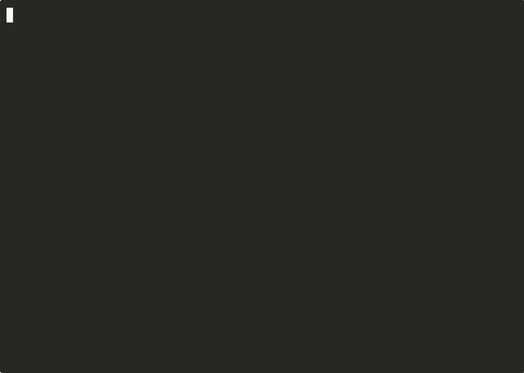

# Arai

An instruction file is advice — the model can read CLAUDE.md and still force-push anyway. Arai turns instruction files (CLAUDE.md, AGENTS.md, .cursorrules, and others) into enforcement via native hooks: rules derived from prohibitive language **block the tool call outright**, advisory rules inject the relevant constraint at the point it applies, and a tamper-evident audit log records, per rule, whether the model actually complied.




## Quick Start

```bash
curl -sSf https://arai.taniwha.ai/install | sh

cd your-project
arai init
```

That's it. Arai discovers your instruction files, extracts the rules, classifies their intent, scans your codebase for context, and sets up native hooks so guardrails fire at the right moment.


## What It Does

When your AI coding assistant (Claude Code or Grok TUI) is about to do something your rules cover, Arai injects the relevant guardrail — right when it matters. Rules derived from prohibitive predicates (`never`, `forbids`, `must_not`) actually **block the tool call** instead of just advising.

```
You: "Create a new database migration"

  PreToolUse: Write migrations/versions/001_add_users.py
  → Arai: deny
    reason: "Alembic never: hand-write migration files"
            [from your rules:12, layer-1 imperative]

Assistant: "I should use alembic revision --autogenerate instead..."
```

Rules only fire when relevant. No noise on `ls`. No repeating principles already in your instruction files.

Every firing is written to a local audit log, and every PostToolUse is correlated with the matching PreToolUse to produce a **compliance verdict** — so you can measure whether the model actually honours the rules you wrote.


## How It Works

1. **Discovers** instruction files in your project and home directory
2. **Extracts** rules by pattern-matching imperative language ("never", "always", "don't", "must")
3. **Classifies** each rule's intent — what action it governs, which tools it applies to, when it should fire
4. **Scans** your codebase with tree-sitter to understand which tools own which directories
5. **Tracks** session state — knows if you've already run tests before pushing
6. **Fires** only relevant rules at the right moment via native hooks (where supported)


## Supported Instruction Files

| File | Tool | Enforcement |
|------|------|-------------|
| `CLAUDE.md` | Claude Code | Hooks (block + advise) |
| `AGENTS.md` / `Agents.md` | Grok TUI (native) | Hooks (block + advise) |
| `~/.claude/CLAUDE.md` | Claude Code (global) | Hooks (block + advise) |
| `~/.grok/` AGENTS.* files | Grok TUI (global) | Hooks (block + advise) |
| `.cursorrules` / `.cursor/rules` | Cursor | MCP (advise) |
| `.windsurfrules` | Windsurf | MCP (advise) |
| `.github/copilot-instructions.md` | GitHub Copilot | Ingest only |

Rules from every file are parsed, classified, and stored the same way — but
enforcement strength depends on what surface the assistant exposes.

- **Claude Code** and **Grok TUI** both support real PreToolUse hooks, so Arai
  can issue `deny` decisions and actually block tool calls.
- Cursor and Windsurf are MCP clients today — they get strong advisory
  enforcement via the MCP server.
- GitHub Copilot currently has no live enforcement surface; the file is
  still ingested for `arai stats`, `arai diff`, and the audit log.

Arai hooks several more events alongside the standard tool-call events
(when the assistant supports them) so the rule set stays accurate to the live
working tree:

- **`FileChanged` + `InstructionsLoaded`** — when an instruction file
  (CLAUDE.md, rules-dir, memory file, ...) is edited on disk or loaded
  into context, Arai spawns an `arai scan` in the background. The next
  tool-call hook sees the updated guardrails — no manual rescan.
- **`CwdChanged`** — when Claude `cd`s into a different directory
  (monorepo navigation), Arai re-scans rooted at the new directory so
  the next tool call matches against the right project's rules.
- **`PostToolBatch`** — when Claude does a batch of parallel tool calls,
  Arai correlates each call individually against any PreToolUse firings
  in the same session, so per-rule compliance verdicts (Obeyed /
  Ignored / Unclear) stay accurate on parallel workloads.


## Smart Matching

Arai doesn't just do keyword matching. It understands your rules:

- **Intent classification** — "never hand-write migration files" only fires on Write, not Edit (editing existing migrations is fine)
- **Code graph** — writing to `migrations/versions/` triggers alembic rules even if the file doesn't mention alembic, because sibling files import it
- **Content sniffing** — detects `from alembic import op` in file content being written
- **Session awareness** — "never push without running tests" suppresses after tests have been run
- **Timing routing** — domain rules fire on tool calls, principles stay silent (already in CLAUDE.md)
- **Broad imperative coverage** — recognises `never/always/don't/must`, `should/shouldn't`, `cannot/refuse`, `make sure/be sure`, `consider/recommend`, bare `No X` prohibitions, conditional shapes (`When X, do Y` / `Before X: do Y` / `If X → do Y`), and the section-aware `Use X` style-guide pattern. Severity mapping mirrors grammatical weight: `should` is `Inform` (soft), `should not` is `Block` (the writer chose to call out a specific prohibition).


## Why not just an instruction file?

| An instruction file alone | With Arai |
|---|---|
| Advice the model can skip under pressure | Prohibitions deny the tool call at the hook |
| No record of what was ignored | Hash-chained audit log; `arai audit --verify` |
| You hope it listened | Per-rule obeyed / ignored / unclear verdicts |
| Rewrite rules into a new policy format | Your existing files *are* the policy |


## Commands

```bash
arai init                  # Discover, extract, classify, scan, set up hooks
arai status                # Show what's being enforced
arai guardrails            # List all active rules
arai why "git push --force" # Explain which rules would fire (dry-run, no audit write)
arai scan                  # Re-scan instruction files
arai scan --code           # Also scan source code (tree-sitter AST)
arai scan --enrich-llm     # Enhance rules via LLM CLI
arai scan --enrich-api     # Enhance rules via API (OpenAI-compatible)
arai add "Never X"         # Add a rule manually
arai audit                 # Inspect the local log of rule firings
arai audit --outcome=ignored # Compliance verdicts where the model ignored a rule
arai audit --rule alembic  # Filter audit by rule subject/predicate/object substring
arai audit --verify        # Verify the SHA-256 hash chain across every day-bucket
arai stats                 # Aggregate audit log — top rules, compliance, token economics
arai stats --by-rule       # Just the per-rule compliance + token economics
arai severity alembic block # Pin a rule's severity (incremental deny rollout)
arai severity --reset alembic # Drop the override; severity reverts to predicate-derived
arai diff CLAUDE.md        # Preview rule-set delta before saving an edit
arai test scenarios.json   # Replay synthetic hook scenarios against rules
arai record --since=1h     # Capture recent firings as a scenario skeleton
arai lint CLAUDE.md        # Parse a file and preview extracted rules
arai trust                 # Manage URLs trusted for shared-policy extends
arai mcp                   # Run the MCP server (stdio) for agent-authored guards
arai upgrade --full        # Switch to full binary (with ONNX enrichment)
```


## Compliance & audit

Beyond firing rules, Arai produces a tamper-evident local record of *every*
guardrail decision and correlates it with what the model actually did. This
is what tech leads and compliance reviewers want to see — the trail behind
the enforcement.

- **Local JSONL audit log** — one line per firing at
  `~/.taniwha/arai/audit/<project>/<YYYYMMDD>.jsonl`. Append-only, day-bucketed,
  queryable with `arai audit` (filters: `--since`, `--tool`, `--event`,
  `--outcome`, `--rule`). Owner-only on disk (0700 dir / 0600 file on Unix;
  `icacls`-pinned on Windows).
- **Hash-chained — actually tamper-evident** — every line carries `prev_hash`
  and `hash` (SHA-256 over canonical bytes); the chain is anchored per-day in
  a `.head.YYYYMMDD` sidecar. `arai audit --verify` walks the chain across
  every day-bucket and exits non-zero on any tamper / reorder / deletion —
  drop it in a cron or pre-archive job to gate evidence integrity.
- **Bring your own collector** — `arai audit --ship <url>` sends pending
  day-buckets *with their chain-head sidecars* to your own HTTPS
  collector, so the hash chain verifies server-side too. Resume cursor,
  idempotent re-ship, optional bearer auth via env var, explicit opt-in
  only. See [docs/audit-ship.md](docs/audit-ship.md) for the payload
  and a minimal collector.
- **Retention controls** — `arai audit --purge --older=90` drops day-buckets
  older than 90 days; `arai audit --purge --project=<slug>` wipes a specific
  project (offboarding / decommission). Today's bucket is always preserved
  and whole files are deleted (never individual lines), so the hash chain on
  retained days stays valid. Pair with `--dry-run` (and `--json`) for a
  pre-purge review, or wire into a scheduled job for time-based retention
  policy.
- **Derivation trace per firing** — each rule entry records source file,
  line number, and parser layer (`from CLAUDE.md:42, layer-1 imperative`).
  Auditors can answer "why did this rule fire?" without code spelunking.
- **Compliance verdicts** — every PostToolUse is correlated against recent
  PreToolUse firings to produce **Obeyed / Ignored / Unclear** per rule.
  `arai stats --by-rule` rolls these up into per-rule ratios with a ⚠ flag
  on rules the model is routing around.
- **Graduated enforcement** — severity tiers (Block / Warn / Inform) derive
  from rule predicate; `arai severity` pins individual rules so you can
  ship a rule set in advise mode and escalate one at a time.
  `ARAI_DENY_MODE=off` is the project-wide rollback path.
- **Regression-tested policy** — `arai test` replays scenarios through the
  live `match_hook` pipeline; `arai record` captures real firings as
  fixtures. Rule changes become CI assertions, not vibes.
- **No data egress** — no network on the hook hot path. Anonymous opt-out
  telemetry is architecturally separate from the audit log; they share no
  code path. The audit data physically cannot leak via the telemetry
  channel. The telemetry queue is hard-capped at 2 MiB on disk.
- **Supply-chain hardened** — every install path verifies the binary
  against published `checksums.txt` (SHA-256). `arai:extends` upstream
  policy fetches refuse loopback / RFC1918 / link-local / cloud metadata
  and disable redirects; **cached upstream policies carry a SHA-256
  sidecar** so a tampered cache file is detected before its rules reach
  the parser.
- **MCP authentication** — the agent-facing MCP server supports an optional
  shared-secret via `ARAI_MCP_AUTH_TOKEN`. When set, `initialize` must
  present a matching token (constant-time compare) before any tool call
  succeeds.

Designed to align with the **SOC 2 Trust Service Criteria** (CC6.1 logical
access, CC6.6 supply-chain, CC7.2 monitoring, CC7.3 detection, CC8.1 change
management, CC9.2 vendor management). Arai is not itself a certified
product — it gives you the controls and the evidence trail; the
certification is yours to pursue. A complete TSC mapping and enterprise /
procurement-team feature inventory is in
[`docs/arai-compliance-features.pdf`](docs/arai-compliance-features.pdf).
The Word source (`.docx`) is committed alongside it for editing.


## Installation

```bash
# Install script (recommended)
curl -sSf https://arai.taniwha.ai/install | sh

# Full binary (with local sentence transformer)
ARAI_FULL=1 curl -sSf https://arai.taniwha.ai/install | sh

# npm
npm install -g @taniwhaai/arai

# Cargo
cargo install arai
cargo install arai --features enrich   # with ONNX model support

# Homebrew
brew install taniwhaai/tap/arai

# Docker (sandboxed install or CI-side enforcement)
docker build -t arai .
docker run --rm -i -v "$(pwd)/.taniwha/arai:/home/arai/.taniwha/arai" arai
# Or via compose with a persistent named volume:
docker compose run --rm arai
```

### Verifying release binaries with cosign

Every release binary is signed in CI using [cosign](https://docs.sigstore.dev/cosign/overview/)
keyless signing via the GitHub OIDC token. The signing certificate is
issued by Fulcio and bound to this repo's release workflow, so verifiers
pin to the workflow identity instead of a long-lived public key. No
private keys, no key rotation.

The `install.sh` and `npm` paths verify SHA-256 checksums by default,
which is enough to catch a corrupted download but not a substituted one.
For higher-assurance environments, verify the cosign signature before
running the binary:

```bash
# 1. Download the binary, its .cosign.bundle, and (optionally) checksums.txt
VERSION=v0.2.24
FILE=arai-linux-x86_64
curl -fL -o "$FILE"               "https://github.com/taniwhaai/arai/releases/download/${VERSION}/${FILE}"
curl -fL -o "${FILE}.cosign.bundle" "https://github.com/taniwhaai/arai/releases/download/${VERSION}/${FILE}.cosign.bundle"

# 2. Verify the signature is bound to this repo's release workflow
cosign verify-blob \
  --bundle "${FILE}.cosign.bundle" \
  --certificate-identity-regexp '^https://github\.com/taniwhaai/arai/\.github/workflows/ci\.yml@refs/tags/v.*' \
  --certificate-oidc-issuer https://token.actions.githubusercontent.com \
  "$FILE"
```

A successful verification prints `Verified OK` and exits 0. Failure
exits non-zero — do not run the binary.

The `--certificate-identity-regexp` and `--certificate-oidc-issuer`
flags are the load-bearing ones: they assert that the signing
certificate was issued to *this* repo's CI workflow on a tag push, not
to some attacker's fork. Loosening either flag defeats the point.

### Verifying SLSA L3 provenance

cosign answers *"was this binary signed by this repo's CI?"*. SLSA
provenance answers the harder question: *"how was this binary built —
which commit, which workflow, which inputs?"*. Together they cover
both the signing identity (cosign) and the build process (SLSA), so
verifiers can detect a tampered build pipeline even if the signing
identity itself is intact.

Releases include a single `<tag>.intoto.jsonl` attestation generated
by the [SLSA GitHub generator](https://github.com/slsa-framework/slsa-github-generator).
Verify consumer-side with [`slsa-verifier`](https://github.com/slsa-framework/slsa-verifier):

```bash
# 1. Download the binary and the release-level provenance attestation
VERSION=v0.2.25
FILE=arai-linux-x86_64
curl -fL -o "$FILE" \
  "https://github.com/taniwhaai/arai/releases/download/${VERSION}/${FILE}"
curl -fL -o "${VERSION}.intoto.jsonl" \
  "https://github.com/taniwhaai/arai/releases/download/${VERSION}/${VERSION}.intoto.jsonl"

# 2. Verify the binary against the provenance, pinned to this repo + tag
slsa-verifier verify-artifact \
  --provenance-path "${VERSION}.intoto.jsonl" \
  --source-uri github.com/taniwhaai/arai \
  --source-tag "${VERSION}" \
  "$FILE"
```

A successful verification prints `PASSED: SLSA verification passed` and
exits 0. Failure exits non-zero — do not run the binary.

`--source-uri` is the load-bearing flag: it asserts that the provenance
was produced from a build of this repo's source. `--source-tag` (or
`--source-branch`) further pins to a specific release.

### What each layer protects against

| Attack | SHA-256 checksums | cosign keyless | SLSA L3 provenance |
|---|---|---|---|
| Corrupted download | ✅ caught | ✅ caught | ✅ caught |
| Substituted binary at release | ❌ checksums.txt would also be swapped | ✅ certificate identity ≠ this repo's workflow | ✅ provenance source-uri ≠ this repo |
| Stolen release-pipeline secret | ❌ | ✅ no long-lived secret to steal | ✅ provenance binds to specific workflow run |
| Tampered build process (compromised toolchain or workflow inputs) | ❌ | ❌ — cosign signs the artifact, not the build | ✅ provenance records the exact workflow, commit, and inputs |

SHA-256 stays the default in `install.sh` / `npm` because it doesn't
require any extra tooling client-side. cosign and SLSA are opt-in for
environments that need the higher tier.


## Performance

| Operation | Median | p95 |
|-----------|--------|-----|
| Hook check (skip-tool — Read/Glob/Agent) | ~22 ms | ~36 ms |
| Hook check (full match pipeline) | ~32 ms | ~55 ms |
| Full init | <200 ms | — |

End-to-end wall clock per tool call (on supported assistants), measured by
`bench/hot_path.sh`. Cost is dominated by Rust binary fork+exec
(~20 ms floor on Linux/WSL); rule matching itself is sub-ms above 200
rules thanks to the LEFT-JOIN'd intent and Aho-Corasick content sniffing.
Rule count between 50 and 500 doesn't materially move the median —
matching is no longer the bottleneck.


## Telemetry

Arai collects anonymous usage data to help us understand if guardrails are actually useful. We track:

- Whether a rule fired and on which tool
- Hook response latency
- Rule counts and enrichment tier on init

We **never** collect file paths, rule text, code content, API keys, or anything that could identify you or your codebase.

**Opt out** at any time:

```bash
export ARAI_TELEMETRY=off   # or DO_NOT_TRACK=1
```

or in `~/.taniwha/arai/config.toml`:

```toml
[telemetry]
enabled = false
```

### Self-hosted collector

Organizations that want the usage signal on **their own
infrastructure** can point the existing queue at their own endpoint —
same events, same anonymity constraints, your retention rules:

```toml
[telemetry]
endpoint = "https://collector.example.com/arai"
bearer_env = "ARAI_TELEMETRY_TOKEN"   # optional; env var NAME, not the token
```

Default behavior is unchanged when `endpoint` is unset. Opt-outs win
regardless of endpoint. HTTPS required (plain HTTP allowed only for
loopback dev collectors), batches retry on failure, and the payload
schema is documented in
[docs/telemetry-payload.md](docs/telemetry-payload.md) so you know
exactly what you're receiving. The audit log remains a separate,
local-only channel.


## Going deeper

The sections above are enough to install Arai and see it block. The full
capability set is documented in focused guides:

- [Enforcement in depth](docs/enforcement.md) — deny mode, per-rule severity
  rollout (`arai severity`), dry-run explanations (`arai why`), compliance
  verdicts, rule expiry
- [The audit log](docs/audit.md) — querying, `--verify` chain checks,
  `arai status`, `arai stats`, token economics
- [Shipping the audit trail](docs/audit-ship.md) — `arai audit --ship` to
  your own collector, with server-side chain verification
- [Testing your rule set](docs/rule-testing.md) — `arai diff`, `arai lint`,
  `arai test`, `arai record`
- [Shared policies](docs/extends.md) — `arai:extends`, trust list, pinning,
  signatures, private policy sources
- [MCP integration](docs/mcp.md) — agent-authored guards for Cursor,
  Windsurf, and any MCP client
- [Rule enrichment](docs/enrichment.md) — the three classification tiers
- [Telemetry payload schema](docs/telemetry-payload.md) — what a
  self-hosted collector receives


## Built By

[Taniwha.ai](https://taniwha.ai) — extracted from the [Kete](https://github.com/taniwhaai/kete) code intelligence platform.


## License

MIT / Apache-2.0
